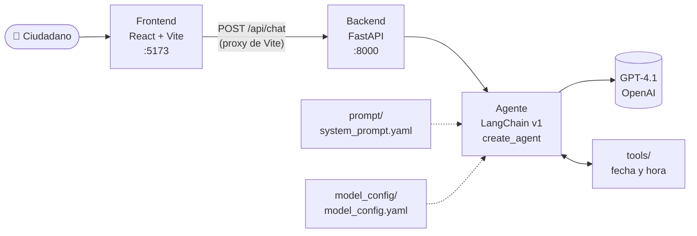

# 🏛️ Giro — Asistente virtual de la Alcaldía de Girardota

> Proyecto del workshop **Vibe Coding desde Cero: Construye tu Primera App IA** — DATAPATH 2026.

Agente conversacional de atención ciudadana para el municipio de **Girardota (Antioquia, Colombia)**. Orienta a la población sobre trámites municipales, PQRSD, programas y servicios de la Alcaldía, a través de un chat web.


---

## ✨ ¿Qué hace?

- 📄 **Trámites:** explica para qué sirve cada trámite (predial, certificado de residencia, licencias, SISBÉN…), qué suele requerir y qué dependencia lo atiende.
- 📨 **PQRSD:** ayuda a identificar si es petición, queja, reclamo, sugerencia o denuncia y cómo radicarla.
- 🚨 **Urgencias:** ante una emergencia remite de inmediato a la línea **123**.
- 🕒 **Fecha y hora reales:** las consulta con una tool en hora de Colombia, cada vez que las necesita.
- 🧠 **Memoria por conversación:** recuerda el contexto dentro de cada sesión de chat.
- 🛡️ **No inventa datos:** costos, plazos, horarios y teléfonos los remite siempre a los canales oficiales.

## 🏗️ Arquitectura



## 📁 Estructura del proyecto

```
.
├── Backend/
│   ├── agent.py                       # Construye el agente (y chat por terminal)
│   ├── api.py                         # API REST con FastAPI
│   ├── prompt/
│   │   └── system_prompt.yaml         # Prompt instruction en formato de tags
│   ├── model_config/
│   │   └── model_config.yaml          # Modelo, temperatura, tokens, reintentos
│   ├── tools/
│   │   ├── __init__.py                # Lista TOOLS que recibe el agente
│   │   └── fecha_hora.py              # obtener_fecha_hora_actual (America/Bogota)
│   ├── requirements.txt
│   └── .env.example
└── Frontend/
    ├── src/
    │   ├── App.jsx                    # Interfaz del chat
    │   └── index.css                  # Estilos
    ├── vite.config.js                 # Proxy /api → Backend
    └── package.json
```

## 🚀 Puesta en marcha

### Requisitos

- Python **3.11+** (probado con 3.13) — se recomienda [uv](https://docs.astral.sh/uv/)
- Node.js **20+** y npm
- Una API key de [OpenAI](https://platform.openai.com/api-keys)

### 1. Backend

```bash
cd Backend

# Entorno virtual y dependencias
uv venv .venv
uv pip install -r requirements.txt
# (alternativa sin uv: python -m venv .venv && .venv/bin/pip install -r requirements.txt)

# Variables de entorno
cp .env.example .env    # y coloca tu OPENAI_API_KEY

# Levantar la API
.venv/bin/uvicorn api:app --reload --port 8000
```

> En Windows usa `.venv\Scripts\uvicorn` en lugar de `.venv/bin/uvicorn`.

### 2. Frontend

En otra terminal:

```bash
cd Frontend
npm install
npm run dev
```

Abre **http://localhost:5173** y empieza a chatear. 🎉

### Probar solo el agente (sin interfaz)

```bash
cd Backend
.venv/bin/python agent.py
```

## 🔌 API

| Método | Ruta | Descripción |
|---|---|---|
| `GET` | `/api/health` | Verifica que la API esté arriba |
| `POST` | `/api/chat` | Envía un mensaje al agente |

**Ejemplo:**

```bash
curl -X POST http://localhost:8000/api/chat \
  -H "Content-Type: application/json" \
  -d '{"session_id": "demo-1", "message": "¿Cómo pago el impuesto predial?"}'
```

```json
{ "reply": "Para pagar el impuesto predial en Girardota..." }
```

El `session_id` identifica la conversación: mismo id → el agente recuerda lo anterior. La documentación interactiva queda en **http://localhost:8000/docs**.

## ⚙️ Configuración

### Modelo — `Backend/model_config/model_config.yaml`

| Clave | Valor | Para qué |
|---|---|---|
| `agent.bot_name` | `Giro` | Nombre del asistente (se inyecta en el prompt) |
| `model.name` | `gpt-4.1` | Modelo de OpenAI |
| `model.temperature` | `0.2` | Bajo: respuestas consistentes, poca invención |
| `model.max_tokens` | `1024` | Tope de longitud de la respuesta |
| `model.timeout` | `60` | Segundos por llamada |
| `model.max_retries` | `2` | Reintentos ante fallos transitorios |

### Prompt — `Backend/prompt/system_prompt.yaml`

El prompt está separado del código y organizado por **tags**, cada uno con una responsabilidad:

`<Identidad>` · `<Personalidad>` · `<Habilidades>` · `<Objetivo_Principal>` · `<Fuentes_De_Datos>` · `<Herramientas_Disponibles>` · `<Instrucciones_Generales>` · `<Deteccion_Intenciones>` · `<Flujos_Por_Intencion>` · `<Formato_De_Respuesta>` · `<IMPORTANTE>`

El placeholder `{bot_name}` se reemplaza al arrancar el agente.

### Tools — `Backend/tools/`

| Tool | Qué devuelve | Cuándo la usa el agente |
|---|---|---|
| `obtener_fecha_hora_actual` | Día de la semana, fecha y hora en Colombia (UTC-5) | Preguntas por la fecha u hora, o expresiones como "hoy", "mañana", "este mes", plazos y horarios |

La fecha **no** va en el prompt: se calcula en cada llamada, así nunca queda congelada aunque el servidor lleve días encendido.

Para añadir una tool nueva: créala en `tools/` con el decorador `@tool`, agrégala a la lista `TOOLS` de `tools/__init__.py` y descríbela en `<Herramientas_Disponibles>` del prompt con el mismo nombre.

### Variables de entorno — `Backend/.env`

| Variable | Obligatoria | Descripción |
|---|---|---|
| `OPENAI_API_KEY` | ✅ | API key de OpenAI |
| `FRONTEND_ORIGINS` | — | Orígenes permitidos por CORS (por defecto `http://localhost:5173`) |

> ⚠️ Nunca subas tu `.env` al repositorio: ya está incluido en `.gitignore`.

## 🤖 Skills de Claude Code

El repo incluye en `.claude/skills/` las skills con las que se construyó el proyecto. Claude Code las carga solo al abrir esta carpeta, así que cualquiera que la clone obtiene las mismas convenciones:

| Skill | Para qué |
|---|---|
| `agente-basico` | Patrón completo: agente LangChain v1 + prompt y modelo en YAML + `tools/` + FastAPI + chat React |
| `agent-prompt-yaml-format` | Formato del system prompt: YAML con metadata y secciones en tags |
| `python-module-structure` | Orden de la cabecera de cada `.py`: docstring, imports, `load_dotenv()`, variables, constantes |

También puedes invocarlas a mano, por ejemplo `/agente-basico`.

## ⚠️ Limitaciones actuales

- **Sin base de conocimiento:** el agente responde con conocimiento general de la administración municipal colombiana; los datos exactos los remite a los canales oficiales.
- **Memoria volátil:** las conversaciones viven en memoria y se pierden al reiniciar el Backend.

## 🗺️ Próximos pasos

- [ ] RAG con documentos oficiales de trámites de la Alcaldía
- [ ] Memoria persistente con Postgres (`PostgresSaver`)
- [ ] Más tools: consulta de estado de PQRSD, agendamiento de citas
- [ ] Observabilidad con Langfuse
- [ ] Despliegue (Backend + Frontend)

---

Hecho con 💚 en el workshop de **DATAPATH** por [Kevin Inofuente](https://github.com/KevinInoCol).
