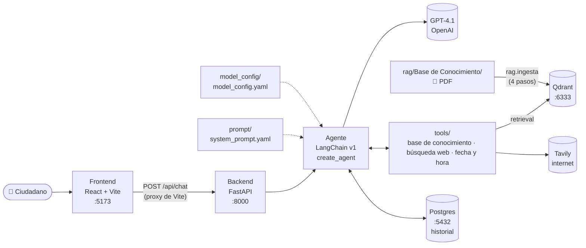

# 🏛️ Giro — Asistente virtual de la Alcaldía de Girardota

> Proyecto del workshop **Vibe Coding desde Cero: Construye tu Primera App IA** — DATAPATH 2026.

Agente conversacional de atención ciudadana para el municipio de **Girardota (Antioquia, Colombia)**. Orienta a la población sobre trámites municipales, PQRSD, programas y servicios de la Alcaldía, a través de un chat web.


---

## ✨ ¿Qué hace?

- 📄 **Trámites:** explica para qué sirve cada trámite (predial, certificado de residencia, licencias, SISBÉN…), qué suele requerir y qué dependencia lo atiende.
- 📨 **PQRSD:** ayuda a identificar si es petición, queja, reclamo, sugerencia o denuncia y cómo radicarla.
- 🚨 **Urgencias:** ante una emergencia remite de inmediato a la línea **123**.
- 📚 **Base de conocimiento (RAG):** responde sobre trámites con el Manual de Trámites oficial del municipio, citando la página.
- 🌐 **Búsqueda en internet:** consulta información actual con [Tavily](https://tavily.com) (requisitos vigentes, horarios, noticias del municipio) y cita las fuentes.
- 🕒 **Fecha y hora reales:** las consulta con una tool en hora de Colombia, cada vez que las necesita.
- 🪵 **Logs en la terminal:** cada mensaje, cada tool que usa el agente (con argumentos y tiempo) y los trámites que recupera del manual.
- 🧠 **Memoria persistente:** cada conversación se guarda en Postgres; el agente la recuerda aunque el servidor se reinicie.
- 🛡️ **No inventa datos:** costos, plazos, horarios y teléfonos solo los da si los encontró en una fuente; si no, remite a los canales oficiales.

## 🏗️ Arquitectura



## 📁 Estructura del proyecto

```
.
├── docker-compose.yml                 # Qdrant + Postgres en local
├── Backend/
│   ├── agent.py                       # Construye el agente (y chat por terminal)
│   ├── api.py                         # API REST con FastAPI
│   ├── prompt/
│   │   └── system_prompt.yaml         # Prompt instruction en formato de tags
│   ├── model_config/
│   │   └── model_config.yaml          # Modelo, temperatura, tokens, reintentos
│   ├── memoria/
│   │   ├── checkpointer.py            # PostgresSaver + pool de conexiones
│   │   └── validacion_esquema_tenant.py
│   ├── middleware/
│   │   └── registro_tools.py          # Log de cada uso de tool (@wrap_tool_call)
│   ├── tools/
│   │   ├── __init__.py                # Lista TOOLS que recibe el agente
│   │   ├── base_conocimiento.py       # buscar_en_base_de_conocimiento (retrieval en Qdrant)
│   │   ├── busqueda_web.py            # buscar_en_internet (Tavily)
│   │   └── fecha_hora.py              # obtener_fecha_hora_actual (America/Bogota)
│   ├── rag/
│   │   ├── config.py                  # Colección y modelo de embeddings (compartido)
│   │   ├── ingesta.py                 # Pipeline RAG: PDF → chunks → embeddings → Qdrant
│   │   ├── retriever.py               # Búsqueda en Qdrant + reconstrucción de trámites completos
│   │   ├── validacion_nombre_tenant_id.py
│   │   └── Base de Conocimiento/      # Aquí van los PDF
│   ├── requirements.txt
│   └── .env.example
└── Frontend/
    ├── src/
    │   ├── App.jsx                    # Chat: trámites frecuentes, Markdown, retoma de conversación
    │   └── index.css                  # Estilos
    ├── vite.config.js                 # Proxy /api → Backend
    └── package.json
```

## 🚀 Puesta en marcha

### Requisitos

- Python **3.11+** (probado con 3.13) — se recomienda [uv](https://docs.astral.sh/uv/)
- Node.js **20+** y npm
- Una API key de [OpenAI](https://platform.openai.com/api-keys)
- [Docker](https://www.docker.com/products/docker-desktop/) para levantar Qdrant
- Una API key de [Tavily](https://app.tavily.com) para la búsqueda en internet (el plan gratuito alcanza)

### 1. Qdrant y Postgres

Desde la raíz del proyecto:

```bash
docker compose up -d
```

| Servicio | Para qué | Dirección |
|---|---|---|
| Qdrant | Base de conocimiento (RAG) | **http://localhost:6333/dashboard** |
| Postgres 18 | Histórico de conversaciones | `localhost:5432` (usuario `girardota`, base `girardota`) |

Los datos persisten en volúmenes de Docker; `docker compose down -v` borra vectores **y** conversaciones. Las credenciales de Postgres son solo para desarrollo local.

### 2. Backend

```bash
cd Backend

# Entorno virtual y dependencias
uv venv .venv
uv pip install -r requirements.txt
# (alternativa sin uv: python -m venv .venv && .venv/bin/pip install -r requirements.txt)

# Variables de entorno
cp .env.example .env    # y coloca tu OPENAI_API_KEY y TAVILY_API_KEY

# Levantar la API
.venv/bin/uvicorn api:app --reload --port 8000
```

> En Windows usa `.venv\Scripts\uvicorn` en lugar de `.venv/bin/uvicorn`.

### 3. Cargar la base de conocimiento (RAG)

Coloca tus PDF en `Backend/rag/Base de Conocimiento/` y ejecuta, desde `Backend/`:

```bash
.venv/bin/python -m rag.ingesta
```

El pipeline tiene 4 pasos:

| Paso | Qué hace | Con qué |
|---|---|---|
| 1. Cargar | Lee cada PDF página por página, quita el encabezado repetido (su fecha queda como metadata), descarta las páginas del índice y normaliza viñetas y espacios | `pypdf` |
| 2. Dividir | **Un chunk por trámite** (`2.1.19 Trámite: ...`) con código, nombre, dependencia y páginas como metadata. Los trámites de más de 3000 caracteres se parten en partes con el nombre del trámite como cabecera | Regex + `RecursiveCharacterTextSplitter` |
| 3. Embeddings | Convierte cada chunk en un vector | OpenAI `text-embedding-3-small` |
| 4. Guardar | Sube chunks y vectores a la colección `tenant_id_alcaldia_girardota` | `QdrantVectorStore` |

Cada ejecución **recrea la colección**: puedes volver a correrlo tras cambiar los PDF sin duplicar datos.

**¿Por qué por trámite?** Con cortes fijos de 1000 caracteres, la lista de documentos de un trámite quedaba partida y mezclada con el siguiente, y el agente respondía requisitos incompletos o de otro trámite. Ahora la recuperación agrupa los resultados por trámite y, si uno está partido, **reúne todas sus partes** antes de entregárselo al agente: siempre recibe el trámite completo.

### 4. Frontend

En otra terminal:

```bash
cd Frontend
npm install
npm run dev
```

Abre **http://localhost:5173** y empieza a chatear. 🎉

El chat muestra las respuestas con formato (listas, negritas, enlaces), ofrece un panel de **trámites frecuentes** del manual y **retoma la conversación al recargar la página**: el `session_id` se guarda en el navegador y el historial se lee de Postgres. "Nueva conversación" empieza una desde cero.

### Probar solo el agente (sin interfaz)

```bash
cd Backend
.venv/bin/python agent.py
```

## 🪵 Logs

Al correr el Backend, la terminal muestra cada conversación y cada tool que usa el agente:

```
23:11:07 | INFO    | agente        | 💬 [licencia] ¿Qué documentos necesito para la licencia urbanística?
23:11:08 | INFO    | agente.tools  | 🔧 buscar_en_base_de_conocimiento ← {'consulta': 'requisitos licencia urbanística'}
23:11:09 | INFO    | agente.rag    |    → 2.1.18 Licencia urbanística (0.66, 16043 caracteres)
23:11:09 | INFO    | agente.tools  | ✅ buscar_en_base_de_conocimiento → 17104 caracteres en 0.93s
23:11:15 | INFO    | agente        | 🤖 [licencia] respuesta de 2892 caracteres en 7.97s
```

El nivel se cambia con `LOG_LEVEL` en `Backend/.env` (`DEBUG`, `INFO`, `WARNING`).

## 🔌 API

| Método | Ruta | Descripción |
|---|---|---|
| `GET` | `/api/health` | Verifica que la API esté arriba |
| `POST` | `/api/chat` | Envía un mensaje al agente |
| `GET` | `/api/historial/{session_id}` | Devuelve la conversación guardada (solo mensajes del usuario y respuestas, sin llamadas internas a tools) |

**Ejemplo:**

```bash
curl -X POST http://localhost:8000/api/chat \
  -H "Content-Type: application/json" \
  -d '{"session_id": "demo-1", "message": "¿Cómo pago el impuesto predial?"}'
```

```json
{ "reply": "Para pagar el impuesto predial en Girardota..." }
```

El `session_id` identifica la conversación: mismo id → el agente recuerda lo anterior. La documentación interactiva queda en **http://localhost:8000/docs**.

## ⚙️ Configuración

### Modelo — `Backend/model_config/model_config.yaml`

| Clave | Valor | Para qué |
|---|---|---|
| `agent.bot_name` | `Giro` | Nombre del asistente (se inyecta en el prompt) |
| `model.name` | `gpt-4.1` | Modelo de OpenAI |
| `model.temperature` | `0.2` | Bajo: respuestas consistentes, poca invención |
| `model.max_tokens` | `2048` | Tope de longitud de la respuesta (los trámites largos tienen listas extensas) |
| `model.timeout` | `60` | Segundos por llamada |
| `model.max_retries` | `2` | Reintentos ante fallos transitorios |

### Prompt — `Backend/prompt/system_prompt.yaml`

El prompt está separado del código y organizado por **tags**, cada uno con una responsabilidad:

`<Identidad>` · `<Personalidad>` · `<Habilidades>` · `<Objetivo_Principal>` · `<Fuentes_De_Datos>` · `<Herramientas_Disponibles>` · `<Reglas_De_Uso_De_Tools>` · `<Instrucciones_Generales>` · `<Deteccion_Intenciones>` · `<Flujos_Por_Intencion>` · `<Formato_De_Respuesta>` · `<IMPORTANTE>`

El placeholder `{bot_name}` se reemplaza al arrancar el agente.

### Tools — `Backend/tools/`

| Tool | Qué devuelve | Cuándo la usa el agente |
|---|---|---|
| `buscar_en_base_de_conocimiento` | El texto **completo** de hasta 2 trámites del manual (con dependencia, páginas y fecha) + otros trámites candidatos por nombre (descarta relevancia < 0.35) | **Siempre primero** en preguntas de trámites: requisitos, documentos, pasos, dependencia, tiempos, costos |
| `obtener_fecha_hora_actual` | Día de la semana, fecha y hora en Colombia (UTC-5) | Preguntas por la fecha u hora, o expresiones como "hoy", "mañana", "este mes", plazos y horarios |
| `buscar_en_internet` | Hasta 5 fuentes (título, URL, fragmento) vía Tavily, priorizando Colombia | Después del manual: si no tiene la respuesta, para datos vigentes (valores, horarios, canales) y noticias o eventos |

La fecha **no** va en el prompt: se calcula en cada llamada, así nunca queda congelada aunque el servidor lleve días encendido.

Para añadir una tool nueva: créala en `tools/` con el decorador `@tool`, agrégala a la lista `TOOLS` de `tools/__init__.py` y descríbela en `<Herramientas_Disponibles>` del prompt con el mismo nombre.

### Variables de entorno — `Backend/.env`

| Variable | Obligatoria | Descripción |
|---|---|---|
| `OPENAI_API_KEY` | ✅ | API key de OpenAI |
| `QDRANT_URL` | — | URL de Qdrant (por defecto `http://localhost:6333`) |
| `QDRANT_COLLECTION` | — | Colección del RAG (por defecto `tenant_id_alcaldia_girardota`) |
| `LOG_LEVEL` | — | Nivel de logs en la terminal (por defecto `INFO`) |
| `POSTGRES_URL` | Recomendada | Conexión a Postgres. Sin ella, la memoria vive en RAM y se pierde al reiniciar |
| `DB_SCHEMA` | Con `POSTGRES_URL` | Esquema donde se guardan las tablas del histórico (`alcaldia_girardota`) |
| `TAVILY_API_KEY` | Recomendada | API key de Tavily. Sin ella, el agente funciona pero sin búsqueda en internet |
| `FRONTEND_ORIGINS` | — | Orígenes permitidos por CORS (por defecto `http://localhost:5173`) |

> ⚠️ Nunca subas tu `.env` al repositorio: ya está incluido en `.gitignore`.

## 🤖 Skills de Claude Code

El repo incluye en `.claude/skills/` las skills con las que se construyó el proyecto. Claude Code las carga solo al abrir esta carpeta, así que cualquiera que la clone obtiene las mismas convenciones:

| Skill | Para qué |
|---|---|
| `agente-basico` | Patrón completo: agente LangChain v1 + prompt y modelo en YAML + `tools/` + FastAPI + chat React |
| `agent-prompt-yaml-format` | Formato del system prompt: YAML con metadata y secciones en tags |
| `python-module-structure` | Orden de la cabecera de cada `.py`: docstring, imports, `load_dotenv()`, variables, constantes |

También puedes invocarlas a mano, por ejemplo `/agente-basico`.

## ⚠️ Limitaciones actuales

- **Manual de 2014:** la base de conocimiento es la versión 04 del Manual de Trámites (19-12-2014). El agente lo aclara al dar requisitos, tiempos o costos y recomienda confirmarlos con la Alcaldía.
- **Qdrant debe estar arriba** para que el agente consulte el manual; si no lo está, el agente sigue funcionando con internet.
- **Historial sin límite:** cada mensaje reenvía al modelo toda la conversación (incluidos los resultados de las tools); en conversaciones muy largas sube el costo por respuesta.

## 🗺️ Próximos pasos

- [x] Pipeline de ingesta RAG a Qdrant
- [x] Tool de recuperación para que el agente consulte la base de conocimiento
- [x] Memoria persistente con Postgres (`PostgresSaver`)
- [ ] Recortar o resumir el historial en conversaciones largas
- [ ] Más tools: consulta de estado de PQRSD, agendamiento de citas
- [ ] Observabilidad con Langfuse
- [ ] Despliegue (Backend + Frontend)

---

Hecho con 💚 en el workshop de **DATAPATH** por [Kevin Inofuente](https://github.com/KevinInoCol).
